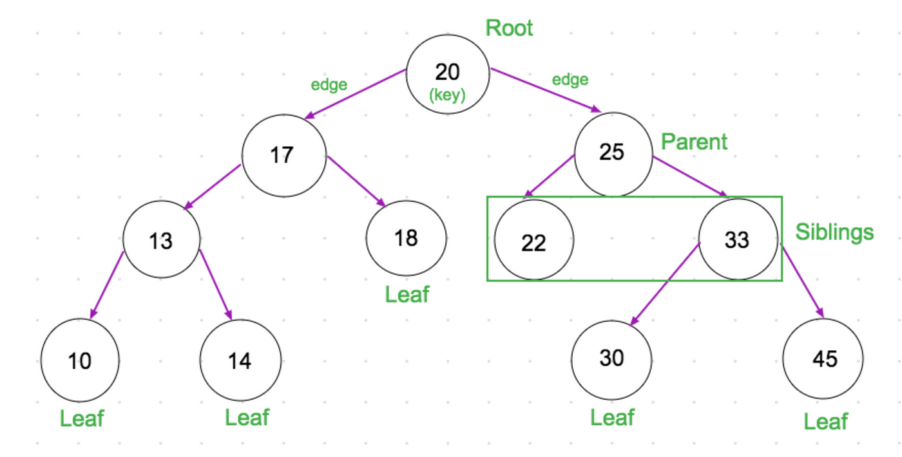

# Binary Search Trees

## What are they?

According to GeeksforGeeks:

> A Binary Search Tree (BST) is a data structure used in computer science for organizing and storing data in a sorted manner. Each node in a BST has at most two children, a left child and a right child, with the left child containing values less than the parent node and the right child containing values greater than the parent node. This hierarchical structure allows for efficient searching, insertion, and deletion operations on the data stored in the tree.

A simple BST is shown below:

## Advantages of using a BST

-   When balanced, a BST is very efficient in insertion and deletion. The time complexity is O(log n).
-   The items are always kept in a sorted sequence since BST can automatically sort them as they are entered.
-   BSTs store only the key values, making them space-efficient

## Disadvantages of using a BST

-   The key drawback is that a balanced binary search tree needs to be implemented at all times. Otherwise, it's possible that the cost of operations won't be logarithmic (Olog n) and will instead result in a linear array search (On).
-   BSTs require additional memory to store pointers to child nodes.
-   Since the time complexity for search, insert, and delete operations is O(log n), which is good for big data sets but slower than some other data structures like arrays or hash tables, they are not well-suited for data structures that need to be accessed randomly.

## To test out my JavaScript implementation of BST

1. Fork/clone repo and run in your favorite editor (mine is VS Code).
2. Run `npm install` to install all the necessary dependencies.
3. Run `nodemon ./src/driverScript.js` to run the script using NodeJS.
4. Un-comment the lines of code and have fun!

### References

1. [GeeksforGeeks](https://www.geeksforgeeks.org/applications-advantages-and-disadvantages-of-binary-search-tree/)
2. [Javatpoint](https://www.javatpoint.com/advantages-and-disadvantages-of-binary-search-tree)
3. [The Odin Project](https://www.theodinproject.com/lessons/javascript-binary-search-trees)
